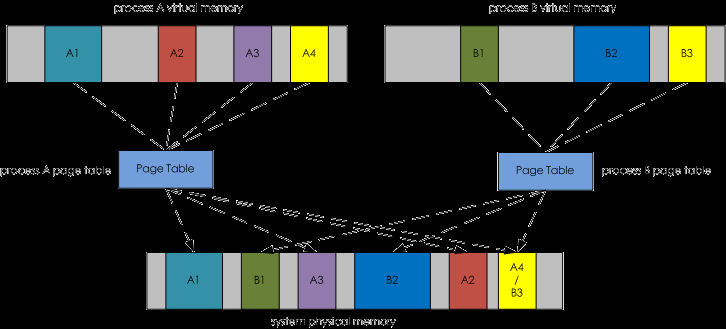

# atme-linux

## 常用监控工具

### 一、IO
#### 1.1 iotop工具
某些进程使用了多少你宝贵的 I/O 资源,iostat 命令也是查看 I/O 状态的，但他监控的是系统级别的 I/O 情况，而 iotop 监控的是进程级别的，可以监控到哪一个进程使用的 I/O 信息。
```
各个参数说明：(除了传参，可以在运行过程中按相应的按键)

　　-o, --only只显示正在产生I/O的进程或线程。除了传参，可以在运行过程中按o生效。
　　-b, --batch非交互模式，一般用来记录日志。
　　-n NUM, --iter=NUM设置监测的次数，默认无限。在非交互模式下很有用。
　　-d SEC, --delay=SEC设置每次监测的间隔，默认1秒，接受非整形数据例如1.1。
　　-p PID, --pid=PID指定监测的进程/线程。
　　-u USER, --user=USER指定监测某个用户产生的I/O。
　　-P, --processes仅显示进程，默认iotop显示所有线程。
　　-a, --accumulated显示累积的I/O，而不是带宽。
　　-k, --kilobytes使用kB单位，而不是对人友好的单位。在非交互模式下，脚本编程有用。
　　-t, --time 加上时间戳，非交互非模式。
　　-q, --quiet 禁止头几行，非交互模式。有三种指定方式。
　　-q 只在第一次监测时显示列名
　　-qq 永远不显示列名。
　　-qqq 永远不显示I/O汇总。
交互按键：
　　和top命令类似，iotop也支持以下几个交互按键。
　　left和right方向键：改变排序。　　
　　r：反向排序。
　　o：切换至选项--only。
　　p：切换至--processes选项。
　　a：切换至--accumulated选项。
　　q：退出。
　　i：改变线程的优先级。
```
时间刷新间隔2秒，输出5次： iotop  -d 2 -n 5
非交互式，输出5次，间隔2秒，输出到屏幕，也可输出到日志文本，用于监控某时间段的io信息
iotop -botq -n 5 -d 2
非交互式，输出pid为8382的进程信息
iotop -botq -p 8382

### 二、cpu


#### 2.1 cpu 火焰图分析

通过cpu火焰图查看热点


- [火焰图--记一次cpu降温过程](https://www.cnblogs.com/jijunjian/p/12637246.html)
- [火焰图分析CPU性能问题](https://www.cnblogs.com/xiaoxitest/p/10584542.html)


#### 2.2 top

1. tasks: 进程总数，运行的进程数，睡眠的进程数，停止的进程数，僵尸 进程数
2. 使用top命令后，按f, 可以选择相关参数，按d标示 是否显示，按q标示退出

top -p 进程号 -H ，查看cpu高的线程--》printf "%x" 线程pid ———》jstack 上一步结果 > thread.txt

ps -eLf | grep java | wc -l 监控java 线程数
netstat -n | grep tcp | grep 侦听端口 | wc -l 监控网络客户连接数

3. 理解virt res shr之间的关系-你的程序在运行时占用了多少内存（物理内存）

- virt:虚拟内存（Virtual Memory）
虚拟内存是一个假想的内存空间，在程序运行过程中虚拟内存空间中需要被访问的部分会被映射到物理内存，虚拟内存大并不表示物理内存大，只表示程序运行过程中可访问的空间比较大。




virt虚拟内存空间= 图中的A1+A2+A3+A4+灰色部分所有空间的总和 = 已经映射到物理内存空间的部分+尚未映射到物理内存空间部分的总和


- res:常驻内存（Resident Memory）
是指被映射到进程虚拟内存空间的物理内存，上图中的被着色部分，是进程占用内存多少的指标。


Res = A1+A2+A3+A4 = 已经映射到物理内存空间的那部分大小= 程序实际消耗的内存

- shr：共享内存，进程与进程之间共享的内存大小
shr = 进程A虚拟内存空间中的A4和进程B虚拟内存空间中的B3都映射到了物理内存空间的A4/B3部分


- smaps文件，linux通过proc文件系统为**每个进程**都提供了一个smaps文件，通过分析该文件我们就可以用来解决以下问题：

* 进程的虚拟内存空间的分布情况，比如heap占用了多少空间、文件映射（mmap）占用了多少空间、stack占用了多少空间？

* 进程是否有被交换到swap空间的内存，如果有，被交换出去的大小？
* mmap方式打开的数据文件有多少页在内存中是脏页（dirty page）没有被写回到磁盘的？
* mmap方式打开的数据文件当前有多少页面已经在内存中，有多少页面还在磁盘中没有加载到page cahe中？

4. 一些按键：

|  显示 | 按键|
|---| --- |
| 显示MB/GB   |按键E切换|
| 显示进程启动命令   |按键C切换|
| 显示按键帮助   |按键h切换|

显示M/G -- 按键E切换
显示进程启动命令 -- 按键C切换


0. top的参考文献：

- [理解virt res shr之间的关系](https://www.orchome.com/298)


### 2.3 nmon

TODO

### 三、network

#### 3.1 IPTraf
IPTraf 是诊断网络问题的利器，他可以监控系统的所有网络流量。可以为指定的端口、传输类型设置过滤器。

IPTraf 就像是一个轻量级的 Wireshark。通过 IPTraf 可以做很多细致的操作，例如按总体数据包大小对流量进行统计细分

#### 3.2 nc
简介：
- ncat 或者说 nc 是一款功能类似 cat 的工具，
- 是用于网络的。它是一款拥有多种功能的 CLI 工具，可以用来**在网络上读、写以及重定向数据**。
- 它被设计成可以被脚本或其他程序调用的可靠的后端工具。同时由于它能创建任意所需的连接，因此也是一个很好的网络调试工具

主要有如下使用方法：
- 监听udp端口：`ncat -l  -u 1234` 用 `netstat -tunlp | grep 1234`,-k 强制服务器保持连接并继续监听端口
- 想发送或者说测试某个远程主机 UDP 端口的连通性 `ncat -v -u {host-ip} {udp-port}`
- 使用ncat作为聊天工具：服务端  `ncat -l 8080` 和客户端 ` ncat 192.168.1.100 8080`
- nc 作为代理 ：` ncat -l 8080 | ncat 192.168.1.200 80`  我们服务器 8080 端口的连接都会自动转发到 192.168.1.200 上的 80 端
  nc作为代理双向联通：
- nc作为端口转发 ` ncat -u -l  80 -c  'ncat -u -l 8080'`

[nc命令详解](https://linux.cn/article-9190-1.html)


#### 3.3 ss

- 用来显示处于活动状态的套接字信息。ss命令可以用来获取socket统计信息，它可以显示和netstat类似的内容。但ss的优势在于它能够显示更多更详细的有关TCP和连接状态的信息，而且比netstat更快速更高效

```
-h, --help      帮助信息
-V, --version   程序版本信息
-n, --numeric   不解析服务名称
-r, --resolve   解析主机名
-a, --all       显示所有套接字（sockets）
-l, --listening 显示监听状态的套接字（sockets）
-o, --options   显示计时器信息
-e, --extended  显示详细的套接字（sockets）信息
-m, --memory    显示套接字（socket）的内存使用情况
-p, --processes 显示使用套接字（socket）的进程
-i, --info      显示 TCP内部信息
-s, --summary   显示套接字（socket）使用概况
-4, --ipv4      仅显示IPv4的套接字（sockets）
-6, --ipv6      仅显示IPv6的套接字（sockets）
-0, --packet    显示 PACKET 套接字（socket）
-t, --tcp       仅显示 TCP套接字（sockets）
-u, --udp       仅显示 UCP套接字（sockets）
-d, --dccp      仅显示 DCCP套接字（sockets）
-w, --raw       仅显示 RAW套接字（sockets）
-x, --unix      仅显示 Unix套接字（sockets）
-f, --family=FAMILY  显示 FAMILY类型的套接字（sockets），FAMILY可选，支持  unix, inet, inet6, link, netlink
-A, --query=QUERY, --socket=QUERY
      QUERY := {all|inet|tcp|udp|raw|unix|packet|netlink}[,QUERY]
-D, --diag=FILE     将原始TCP套接字（sockets）信息转储到文件
 -F, --filter=FILE  从文件中都去过滤器信息
       FILTER := [ state TCP-STATE ] [ EXPRESSION ]


```

实例：

```
ss -t -a    # 显示TCP连接
ss -s       # 显示 Sockets 摘要
ss -l       # 列出所有打开的网络连接端口
ss -pl      # 查看进程使用的socket
ss -lp | grep 3306  # 找出打开套接字/端口应用程序
ss -u -a    显示所有UDP Sockets
ss -o state established '( dport = :smtp or sport = :smtp )' # 显示所有状态为established的SMTP连接
ss -o state established '( dport = :http or sport = :http )' # 显示所有状态为Established的HTTP连接
ss -o state fin-wait-1 '( sport = :http or sport = :https )' dst 193.233.7/24  # 列举出处于 FIN-WAIT-1状态的源端口为 80或者 443，目标网络为 193.233.7/24所有 tcp套接字

# ss 和 netstat 效率对比
time netstat -at
time ss

# 匹配远程地址和端口号
# ss dst ADDRESS_PATTERN
ss dst 192.168.1.5
ss dst 192.168.119.113:http
ss dst 192.168.119.113:smtp
ss dst 192.168.119.113:443

# 匹配本地地址和端口号
# ss src ADDRESS_PATTERN
ss src 192.168.119.103
ss src 192.168.119.103:http
ss src 192.168.119.103:80
ss src 192.168.119.103:smtp
ss src 192.168.119.103:25
```
用TCP 状态过滤Sockets

```
ss -4 state closing
# ss -4 state FILTER-NAME-HERE
# ss -6 state FILTER-NAME-HERE
# FILTER-NAME-HERE 可以代表以下任何一个：
# established、 syn-sent、 syn-recv、 fin-wait-1、 fin-wait-2、 time-wait、 closed、 close-wait、 last-ack、 listen、 closing、
# all : 所有以上状态
# connected : 除了listen and closed的所有状态
# synchronized :所有已连接的状态除了syn-sent
# bucket : 显示状态为maintained as minisockets,如：time-wait和syn-recv.
# big : 和bucket相反.
```
显示TCP连接

`ss -t -a`

显示UDP sockets

`ss -u -a`

所有端口为 22（ssh）的连接
`ss state all sport = :ssh`


### 四、综合类型工具


#### 4.1 htop工具

- [htop使用详解](https://www.cnblogs.com/programmer-tlh/p/11726016.html)

#### 4.2  Monit工具
Monit 允许对进程、端口、文件等目标进行监控，并且可以设置动态的告警模式。支持对进程的重启

- [centos7使用monit监控服务运行状态](https://blog.51cto.com/u_12173069/2307649)

#### 4.3 lsof工具 -lists openfiles

可以使用它来获得你系统上设备的信息，你能通过它了解到指定的用户在指定的地点正在碰什么东西，或者甚至是一个进程正在使用什么文件或网络连接。

默认 : 没有选项，lsof列出活跃进程的所有打开文件
组合 : 可以将选项组合到一起，如-abc，但要当心哪些选项需要参数
-a : 结果进行“与”运算（而不是“或”）
-l : 在输出显示用户ID而不是用户名
-h : 获得帮助
-t : 仅获取进程ID
-U : 获取UNIX套接口地址
-F : 格式化输出结果，用于其它命令。可以通过多种方式格式化，如-F pcfn（用于进程id、命令名、文件描述符、文件名，并以空终止）

#####  4.3.1 处理网络方面

- -i 使用-i显示所有连接


`lsof -i[46] [protocol][@hostname|hostaddr][:service|port]`
有些人喜欢用netstat来获取网络连接

显示TCP连接（同理可获得UDP连接）- **lsof  -iTCP**

使用-i:port来显示与指定端口相关的网络信息，`lsof  -i :22`,注意这个冒号和端口连在一起，我总忘记


使用@host来显示指定到指定主机的连接- 你在检查是否开放连接到网络中或互联网上某个指定主机的连接时十分有用 ` lsof  -i@172.16.12.5`

使用@host:port显示基于主机与端口的连接 - `  lsof  -i@172.16.12.5:22`

指出监听端口 `lsof  -i -sTCP:LISTEN`

你也可以获取各种用户的信息，以及它们在系统上正干着的事情，包括它们的网络活动、对文件的操作等。


##### 4.3.2 处理用户信息

-u显示指定用户打开了什么 - `lsof  -u daniel`

##### 4.3.3 命令和进程

可以查看指定程序或进程由什么启动，这通常会很有用，而你可以使用lsof通过名称或进程ID过滤来完成这个任务。下面列出了一些选项：

使用-c查看指定的命令正在使用的文件和网络连接-   `lsof -c nginx |grep log`

`lsof -c java |grep log`


使用-p查看指定进程ID已打开的内容- ` lsof  -p 10075`

t选项只返回PID `  lsof -t -c nginx`

##### 4.3.4 文件和目录

查看指定文件或目录，你可以看到系统上所有正与其交互的资源——包括用户、进程等。

显示与指定目录交互的所有一切   `lsof  /var/log/messages/`


### 五、实战案例

#### 5.1 Q-如何查看一个进程的线程数？

- 方式一：使用top命令

1. 具体用法是 `top -H`
   加上这个选项，top的每一行就不是显示一个进程，而是一个线程。

2. `top -p 20378 ` 只显示该进程的变化情况 ，但是在按`H（shift + h）`后，会显示threads的信息，但是总的CPU占用之和远小于没按H之前的占用之和。

-  方式二：使用ps命令

1. 具体用法是 `ps -xH`

这样可以查看所有存在的线程，也可以使用grep作进一步的过滤。

2.` ps -Lf pid`

  查看对应进程下的线程信息,查到pid 22564下有1个进程（自身）+48个线程

3. `ps -mq PID` 可以看到指定的进程产生的线程数目
4. `ps –o nlwp pid`
nlwp含义是`number of light-weight process`，看到该进程内有多少个线程，该进程内部有多少个线程；但是并没有排除处于`idle`状态的线程。要想获得真正在`running`的线程数量

`ps -eLo pid ,stat | grep 27989 | grep running | wc -l`，其中ps -eLo pid ,stat可以找出所有线程，并打印其所在的进程号和线程当前的状态

- 方式三：`pstree -p pid `

通过进程PID查看进程下线程的PID

#### 5.2 Q-如何定位cpu高负载的排查?

> 线上一个java进程cpu负载100%。一个成熟的方案如下：

1. 执行`top -c`命令，找到cpu最高的进程的id

2. 执行`top -H -p pid`，这个命令就能显示刚刚找到的进程的所有线程的资源消耗情况。找到CPU负载高的线程pid 8627, 把这个数字转换成16进制，21B3（10进制转16进制，用linux命令:` printf %x 8627`获取线程nid）。

3. 执行`jstack -l pid`，拿到进程的线程dump文件。这个命令会打出这个进程的所有线程的运行堆栈,或者  jstack 30663 |grep -B 10 -A 10 线程nid

4. 用记事本打开这个文件，搜索“21B3”，就是搜一下16进制显示的线程id。搜到后，下面的堆栈就是这个线程打出来的。排查问题从这里深入。

> 经常遇到的常见问题，判断是不是GC引起的问题？

1. **时序分析**：因为不断GC，CPU 负载高 -> 慢查询增多 -> GC 耗时增大 -> 线程Block增多 -> RT 上涨

`VM THREAD`把进程的资源耗尽。那只能说明是jvm在耗cpu。很容易想到是疯狂的GC，按关键字 `overhead`搜一下系统日志， 发现 `java.lang.OutOfMemoryError: GC overhead limit exceeded`日志。
jvm在疯狂的`Full GC`，而且有个大对象始终根节点路径可达，无法释放。dump了一下这个实例的内存，发现确实有大对象，占用了一个多G的堆内存，也可以进一步分析一下是否是内存泄漏问题

1. 结论二：cpu高是因为出现死循环


https://app.datadoghq.com/signup/agent#centos


#### 5.3 Q-load高、cpu低的问题排查思路?

Java应用load高的几种原因总结

这里总结一下load高常见的、可能的一些原因：

- 死循环或者不合理的大量循环操作，如果不是循环操作，按照现代cpu的处理速度来说处理一大段代码也就一会会儿的事，基本对能力无消耗
- 频繁的`YoungGC`
- 频繁的`FullGC`
- 高磁盘`IO`
- 高网络`IO`

线上遇到问题的时候首先不要慌，因为大部分load高的问题都集中在以上几个点里面，以下分析问题的步骤或许能帮你整理思路：

- top先查看用户us与空闲us(id)的cpu占比，目的是确认load高是否高cpu起的
- 如果是高cpu引起的，那么确认一下是否gc引起的，**jstat命令 + gc日志**基本就能确认
    1. gc引起的高cpu直接dump，非gc引起的分析线程堆栈
    2. 如果不是高cpu引起的，查看磁盘io占比(`wa`)，如果是，那么打线程堆栈分析是否有大量的文件io
    3. 如果不是高cpu引起的，且不是磁盘io导致的，检查各依赖子系统的调用耗时，高耗时的网络调用很可能是罪魁祸首

- 最后还是不行，当束手无策时，jstack打印堆栈多分析分析吧，或许能灵光一现能找到错误原因。

结语

先有理论，把理论想透了，实战碰到问题的时候才能头脑清楚。

坦白讲，cpu和load高排查是一个很偏实战的事情，这方面我还也有很长一条路需要走，身边在这块经验比我丰富的同事多得很。很多人有问过我，项目比较简单，根本没有这种线上问题需要我去排查怎么办？这个问题只能说，平时多积累、多实战是唯一途径，假如没有实战机会，那么推荐三种方式：

- 自己通过代码模拟各种异常，例如FullGC、死锁、死循环，然后利用工具去查，可能比较简单，但是万丈高楼平地起，再复杂的东西都是由简单的变化过来的
- 多上服务器上敲敲top、sar、iostat这些命令，熟记每个命令的作用及输出参数的含义
- 去网上找一下其他人处理FullGC、cpu高方法的文章，站在巨人的肩膀上，看看前人走过的路，总结记录一些实用的点


0. Cpu load高、利用率低的问题排除参考文献
- [ load高、cpu低的问题排查思路](https://blog.csdn.net/weixin_39877166/article/details/110827810?utm_medium=distribute.pc_relevant_t0.none-task-blog-2%7Edefault%7EBlogCommendFromMachineLearnPai2%7Edefault-1.base&depth_1-utm_source=distribute.pc_relevant_t0.none-task-blog-2%7Edefault%7EBlogCommendFromMachineLearnPai2%7Edefault-1.base)


#### 5.4 Q-JVM内存泄漏排查思路？
内存对象是你已经不用了对象，但是gc不掉


- [java内存泄漏排查](https://blog.csdn.net/fishinhouse/article/details/80781673)


